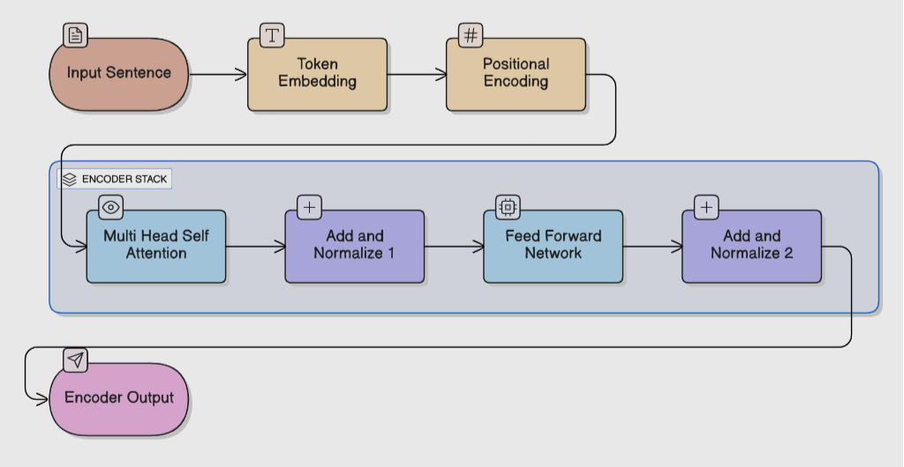

# Transformer Encoder Experiment

Experiment 1: Transformer Encoder – Autoencoding (Masked Language Model)

Objective
To understand Transformer Encoder, Self-Attention, and Autoencoding by:
*   Reconstructing masked text (Masked Language Modeling - MLM)
*   Visualizing how self-attention captures context.

Encoder Architecture Diagram

Autoencoding Explanation

Autoencoding in Transformers (like BERT) involves corrupting the input (masking some words) and training the model to reconstruct the original input. unlike RNNs which process sequentially, the Transformer Encoder sees the *entire* sentence at once (Bidirectional context), making it powerful for understanding relationships between words.

Sample Inputs & Outputs

Input: `Transformers use [MASK] attention`
Reconstructed: `Transformers use self attention`

Input: `Mars is called the [MASK] planet`
Reconstructed: `Mars is called the red planet`

Input: `Online learning improves [MASK] access`
Reconstructed: `Online learning improves educational access`

Visualization

The heatmap above shows the Self-Attention weights for the sentence "Transformers use [MASK] attention".
*   Darker/Different colors indicate higher attention scores.
*   You can see how the word "[MASK]" might attend to "Transformers" or "attention" to figure out it should be "self".

Generated Output:

Vocab size: 44
Training MLM Reconstruction...
Epoch 20, Loss: 0.0223
Epoch 40, Loss: 0.0082
Epoch 60, Loss: 0.0045
Epoch 80, Loss: 0.0028
Epoch 100, Loss: 0.0020

--- Reconstruction Results ---
Input : Transformers use [MASK] attention
Pred  : Transformers use self attention
------------------------------
Input : Mars is called the [MASK] planet
Pred  : Mars is called the red planet
------------------------------
Input : Online learning improves [MASK] access
Pred  : Online learning improves educational access
------------------------------
Input : Exercise improves [MASK] health
Pred  : Exercise improves mental health
------------------------------
Input : Cricket is a [MASK] sport
Pred  : Cricket is a popular sport
------------------------------
Input : Python is a [MASK] language
Pred  : Python is a programming language
------------------------------
Input : Neural networks have [MASK] layers
Pred  : Neural networks have hidden layers
------------------------------
Input : Trees reduce [MASK] pollution
Pred  : Trees reduce air pollution
------------------------------
Input : Robots perform [MASK] tasks
Pred  : Robots perform repetitive tasks
------------------------------
Input : Solar power is a [MASK] source
Pred  : Solar power is a renewable source
------------------------------
Training Complete. Results saved.
