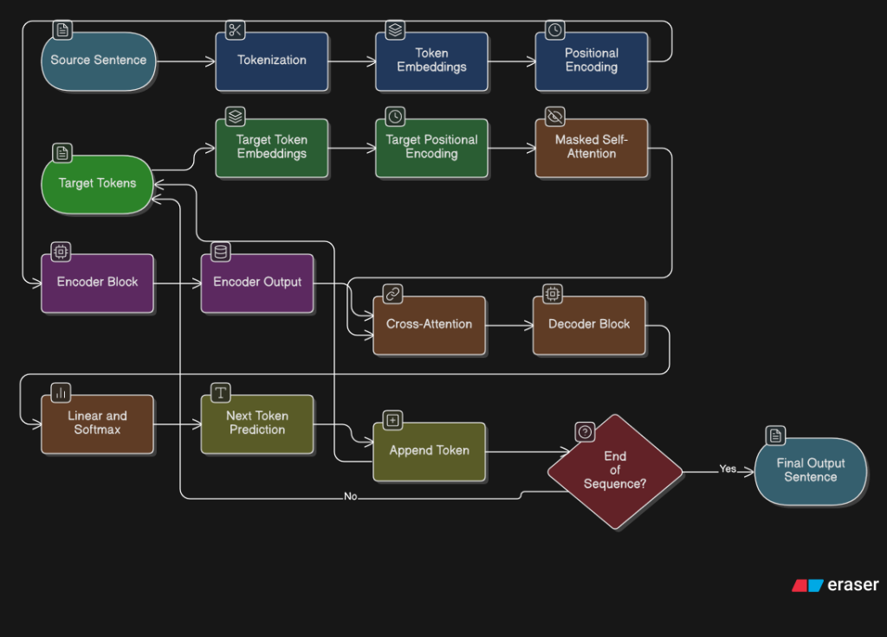
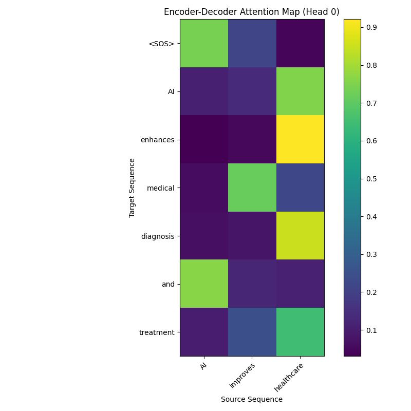

Transformer Seq2Seq Experiment

Experiment 2: Transformer Decoder – Autoregression / Seq2Seq

Objective
To understand Decoder-only Transformers, Causal Masking, Autoregression, and Seq2Seq tasks by building a text generation system.

Encoder-Decoder Flow



1.  Input Processing: The source sentence (English) is tokenized and converted to embeddings.
2.  Encoder: 
    -   Receives the source embeddings + positional encodings.
    -   Uses Self-Attention to understand the context of each word relative to others.
    -   Outputs a context representation of the source sentence.
3.  Decoder:
    -   Receives the target sequence generated so far (starting with `<SOS>`).
    -  Masked Self-Attention: Looks at previous tokens in the target sequence but is blocked (masked) from seeing future tokens.
    -   Cross-Attention: Looks at the Encoder's output to focus on relevant parts of the source sentence.
    -   Generates the next token probability distribution.
4.Output: The token with the highest probability is selected and appended to the target sequence. This repeats until `<EOS>` is generated.

Causal Mask Explanation

The Causal Mask (or Look-Ahead Mask) is crucial for the Decoder. In autoregressive generation, the model predicts the next token based *only* on past tokens.
If we didn't mask future positions during training (where we feed the whole target sentence), the model would "cheat" by seeing the word it's supposed to predict.

The mask is a matrix where:
-   Rows correspond to the current position.
-   Columns correspond to attending positions.
-   The Upper Triangle is set to `-inf` (or masked), preventing position `i` from attending to `j` if `j > i`.

Running the Experiment

1.  Train the Model:
    ```bash
    python train.py
    ```
    This trains the Transformer on the sample inputs provided (Student S36-S70 dataset).

2.  Run Inference:
    ```bash
    python inference.py
    ```
    This generates outputs for the test prompts.

Sample Outputs

Example 1:
Input: "AI improves healthcare"
Output: "AI enhances medical diagnosis and treatment"

*Example 2:*
Input: "What is self-attention?"
Output: "Self-attention relates each word to every other word"

Visualization



(The heatmap above shows the Cross-Attention weights. The x-axis matches Source tokens and y-axis matches Generated Target tokens, showing which words the model focused on.)

Generated Outputs
PS D:\LLM_Experiments> cd transformer-seq2seq                                     
PS D:\LLM_Experiments\transformer-seq2seq> python train.py                        
Training on 10 samples with vocab size 74...                                      
Epoch 20, Loss: 0.0281
Epoch 40, Loss: 0.0098
Epoch 60, Loss: 0.0052
Epoch 80, Loss: 0.0032
Epoch 100, Loss: 0.0022
Epoch 120, Loss: 0.0016
Epoch 140, Loss: 0.0012
Epoch 160, Loss: 0.0010
Epoch 180, Loss: 0.0008
Epoch 200, Loss: 0.0006
Training Complete. Model and Vocab Saved.
PS D:\LLM_Experiments\transformer-seq2seq> python inference.py                    
Model Loaded. Vocabulary Size: 74                                                 

--- Inference Results ---
Input : AI improves healthcare
Output: AI enhances medical diagnosis and treatment
------------------------------
Input : Transformers process data in parallel
Output: Transformers handle sequences simultaneously
------------------------------
Input : What is self-attention?
Output: Self-attention relates each word to every other word
------------------------------
Input : Why is positional encoding required?
Output: Positional encoding provides word order information
------------------------------
Input : In the future, AI will
Output: In the future, AI will automate decision systems
------------------------------
PS D:\LLM_Experiments\transformer-seq2seq> 